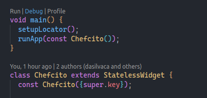

# Chefcito Frontend

## Getting started

Prerrequisites:

* Flutter
* Android Emulator (AVD) or physical device
* Flutter and dart VS Code extensions (optional but highly recommended)

Install flutter packages used in the project:

```bash
flutter pub get
```

Run the app in debug mode:

* **Option 1 - From VS Code extension**: if you have the Flutter and Dart VS Code extension you can run the app by click in the options displayed in the `main.dart` above the main method the extension shows three options to run the app, during development you should use the debug mode:

  
* **Option 2 - Terminal**: in the root of project execute the following commands:

  ```bash
  # Display the devices list
  flutter devices

  # Output example:
  #  		Name					* ID				* Platform			* Platform Version
  #
  # sdk gphone64 x86 64 (mobile) 	* emulator-1234 	* android-x64 		* Android 14 (API 34)
  # Chrome (web)					* chrome			* web-javascript 	* Google Chrome xxxx


  # Run in debug mode
  flutter run -d <device_id>

  ```


## Start coding

The architecture of the app is based on the MVVM pattern, for that we use the [Stacked from FilledStacks](https://stacked.filledstacks.com/docs/getting-started/overview/)'s flutter package.

### Create a view

* first create a folder with the name of the view inside de `ui/views/` folder, with to files inside the folder that we already created with the following structure:

  * View: `<view_name>_view.dart`
  * ViewModel `<view_name>_viewmodel.dart`
* Register the view inside the `app.dart` file on the routes list.
* Run the following command to register the view in the StackedRouter:

```bash
flutter pub run build_runner build
```

* **Note:** The code inside `app.locator.dart` and `app.router.dart` are generated automaticlly after execute de above command.

### Create a service

* Inside the folder services/ create a file `<service_name>.dart`
* Register the new service inside dependencies list inside `app.dart`
* Run the following command to register the service in the StackedLocator:

```bash
flutter pub run build_runner build
```
